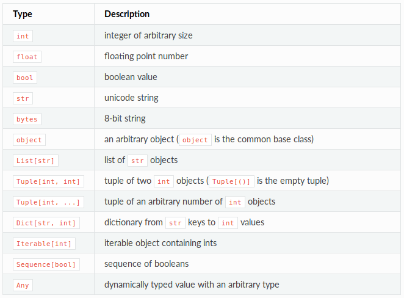

************
mypy-ization
************
Convert python's dynamically typed code to statically typed with ``mypy``.

Advantages of static typing
===========================
1. Find issues earlier

.. code:: python

    # old code
    send_email(email=[recipient])  # recipient = 'someone@somecompany.com'

    # new feature needed to send emails to multiple people
    send_email(email=recipient)  # recipient = ['someone@somecompany.com', 'someotherone@samecompany.com']

2. Readability
3. Refactoring is easy
4. Static types can ease the mental burden of writing programs
5. Types serve as documentation
6. Python type system won't limit you from executing the programs

.. code:: python

	def f(l: List[object], k: List[int]) -> None:
    	l = k
    	l.append('x')

Disadvantages
=============
- Learning curve
- Impose constraints onto programmers
- We'll have to decide the type even when we are unsure about the future of the flow

Introduction to MyPy
====================
- Static type checker or a lint like tool
- You can always work around since the run time doesn't depends on the types
- Different syntax for python2 and python3 -> we'll be following just python3 syntax
- ``PyAnnotate`` from dropbox for automatic annotation
- Modern typing features such as type inference, generics, function types, tuple types and union types
- *Still Experimental*

Basics
======
- Normal Function

.. code:: python

	def greeting_scheduler(email, time):
		name = email.split('@')[0]
		msg = f'GoodMorning {name}'
		status = schedule(msg, email, time)
		return status

- Mypy-ized function
    + Types in the function argument
    + Type declaration
    + Mixing static and dynamic

.. code:: python

	def greeting_scheduler(email: str, time: float) -> dict:
		status: dict
		name: str = email.split('@')[0]
		msg = f'GoodMorning {name}'
		status = schedule(msg, email, time)
		return status

- `Examples`_ 

.. _Examples: simple.py

- Setting up sublime (Emacs coming soon)
Go to Perferences > Package Settings > Anaconda > Settings - User, and add below lines

.. code:: python

	{
		"mypy": true,
		"python_interpreter": "/path/to/python3/interpreter/where/mypy/is/installed",
	}

- Installation
	
``pip install mypy`` or ``pipenv install mypy``

- Type checking programs
	
``mypy program.py``

  + `Command Line Args`_ 
	
  .. _Command Line Args: http://mypy.readthedocs.io/en/stable/command_line.htm

``mypy`` is essentially a linter like tool that checks for type errors. So all the warnings throws by ``mypy`` are ingorable. 

- Type defenition for third party libraries

  + `TypeShed Project`_ 
    
  .. _TypeShed Project: https://github.com/python/typeshed

  + Library stubs - defines skeleton of public interface of the library and should be saved as ``.pyi`` file. 
 
.. code:: python

	import chr
	resp = chr(4)  # think chr is a third party library

``mypy`` has no way to understand what's the return type of chr. Typeshed repo has numerous stub files for different libraries already and it is expanding. If it's not there already, We could create a stub file to tell mypy what's the return type of the library interface. It can be saved in the same directory where our python file is or can be saved in the common stub folder and include the stub folder in the ``MYPYPATH`` env variable. When ``mypy`` is being executed, it searches for files in the given order.

     * The MYPYPATH environment variable (a colon-separated list of directories).
     * The directories containing the sources given on the command line.
     * The relevant directories of the typeshed repo.

So this is how a stub file looks like

.. code:: python

	def chr(code: int) -> str: ...

Typing Classes and it's instances
=================================

Setup code

.. code:: python

	class A:
	    def f(self) -> int:
	        return 2

	class B(A):
	    ...

	class C:
	    def k(self) -> int:
	        return 3

- Type-ing objects

.. code:: python
	
	obj1: A = A()  # success

- Wrong Type-ing

.. code:: python
	
	obj2: B = A()  # raise error
	val = obj1.k()  # raise error by mypy (not at run time, yaaaay)

Supported types
===============

- ``Any`` can override other types

.. code:: python

    first: Any = None
    second: str = ''
    first = 2
    second = a

- Function arguments and return values default to ``Any``
- `Kinds of Types`_ (This is important) 

.. _Kinds of Types: http://mypy.readthedocs.io/en/stable/kinds_of_types.html
